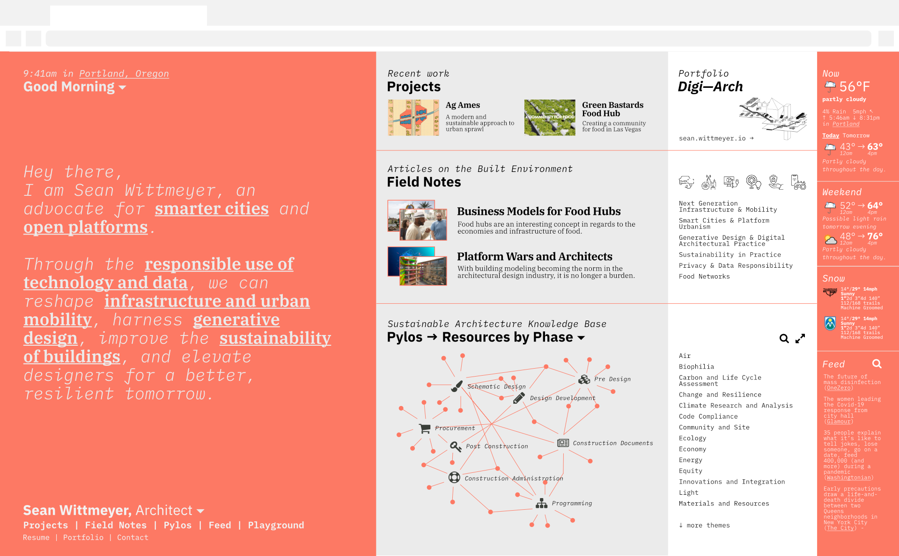

# Builder

Builder is my personal website and playground where I make things for the web.

## Features

Builder is intended to be a place to share my thoughts and expertise with the world while hosting a number of personal tools I use for fun and work. Snoop around to see what is hidden in there if you are curious.

Some of the highlights of the platform include:

- Sustainability knowledge base for sharing strategies, example images, case studies, and computational design tools related to architectural practice. This is largely based on my Pylos project.
- A blog named 'Field Notes' which is where I will share notions on smart cities and architecture
- The Feed, a collection of interesting links and moments across the web, a record of the bleeding edge of architecture, urbanism, cities, and technology
- A simple ski tracker and tool to break down metrics collected from a day on the mountain
- A train tracker for Amtrak service

Others may come and go over time however this is a start. You can learn more about this on my [portfolio site](https://sean.wittmeyer.io/The-New-Builder).

## Configuration

This really wasn't made for other people to use but it's fine if they do. You'll have to prepare a server for Codeigniter 3 to start, the rest of the code will work on first run however you'll need to set up a database and configure it.

## License

Pylos is copyright Sean Wittmeyer is licensed under [The MIT License](LICENSE).
